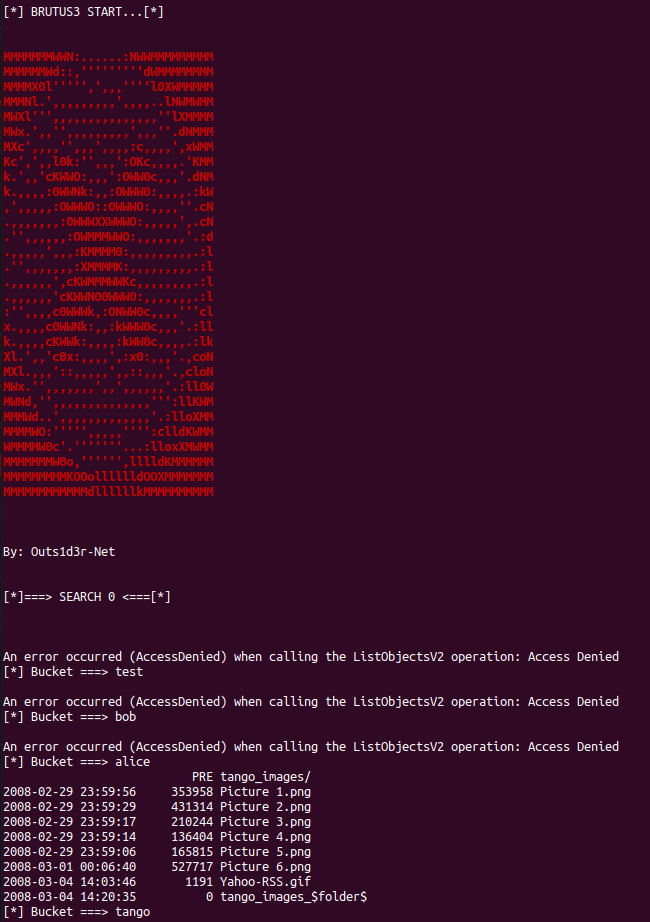

# BrutuS3  
> The Brute force for public AWS S3 discovery !  

[](href="#")

## Advertence  
This software does not offer any kind of guarantee. Its use is exclusive for educational environments and / or security audits  
with the corresponding consent of the client. I am not responsible for its misuse or for any possible damage caused by it.  

## Installation  
#### Install dependencies:  
```
$ sudo apt update
$ sudo apt install -y awscli wget cewl git
$ git clone https://github.com/Outs1d3r-Net/BrutuS3.git
$ cd BrutuS3
```

## Usage  
#### Create a wordlist  
```
$ cewl https://target.com -m 3 -w wordlist.txt
```
#### OR  
```
$ wget https://raw.githubusercontent.com/gwen001/SecLists/master/mine/s3-buckets.txt -O wordlist.txt
```

#### Attack  
```
$ bash BrutuS3.sh wordlist.txt
```
  
  
  
With great powers, great responsibilities !  


